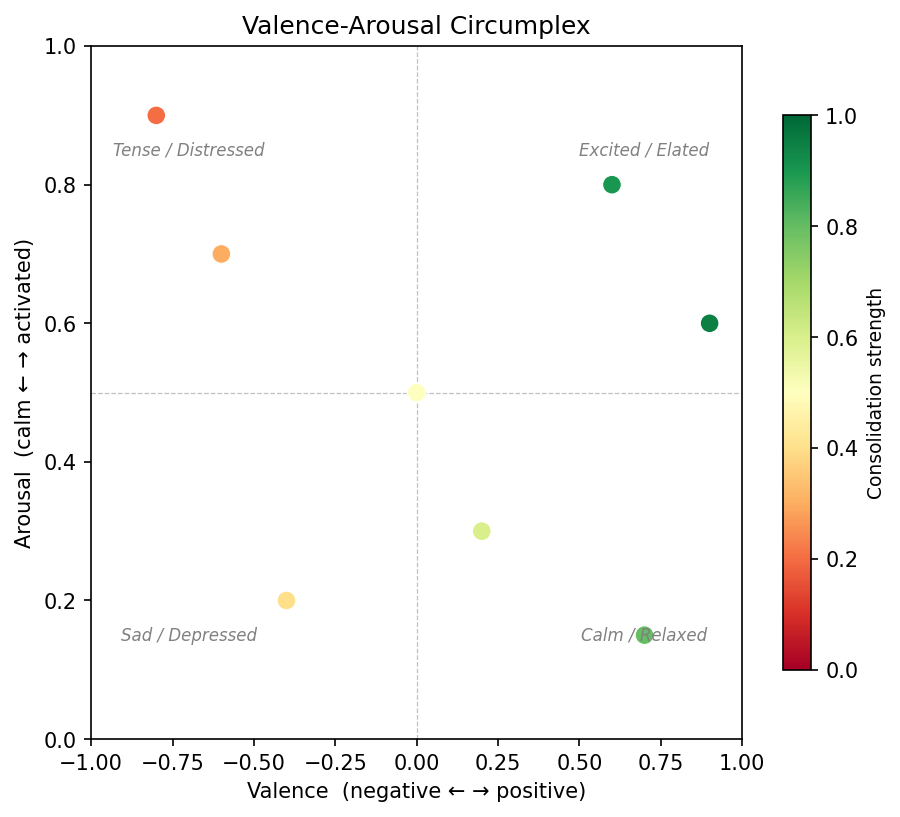
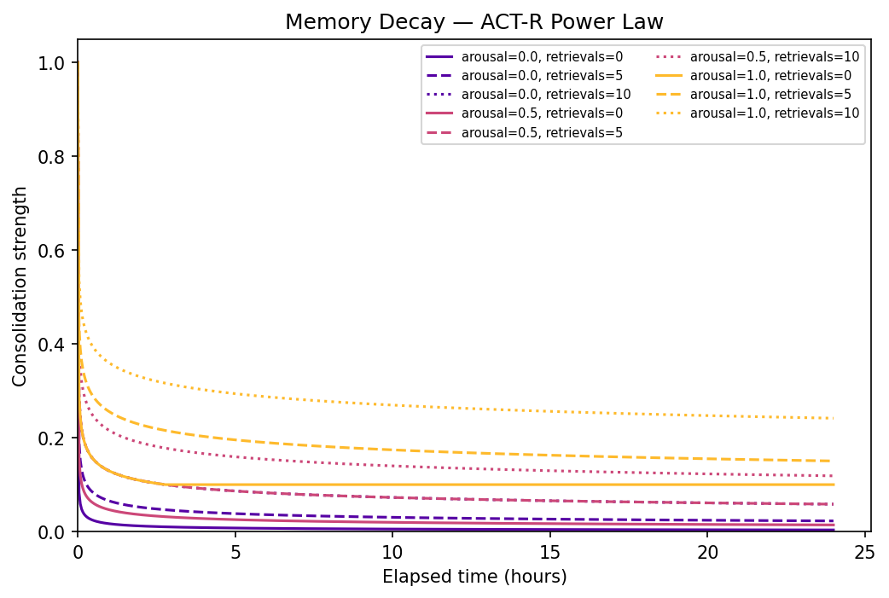
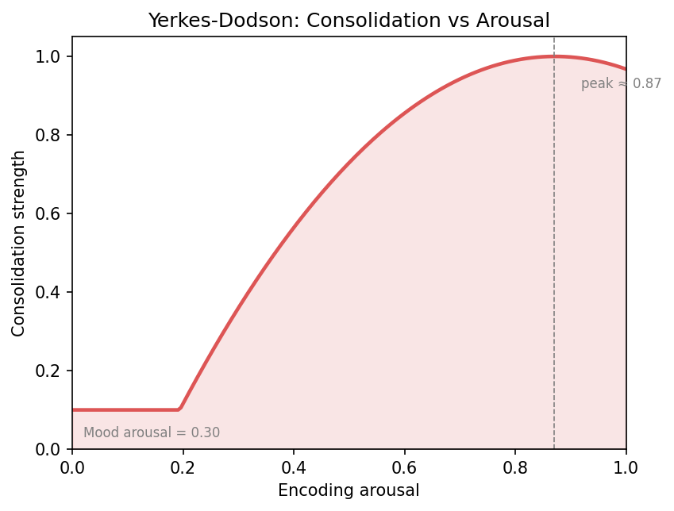
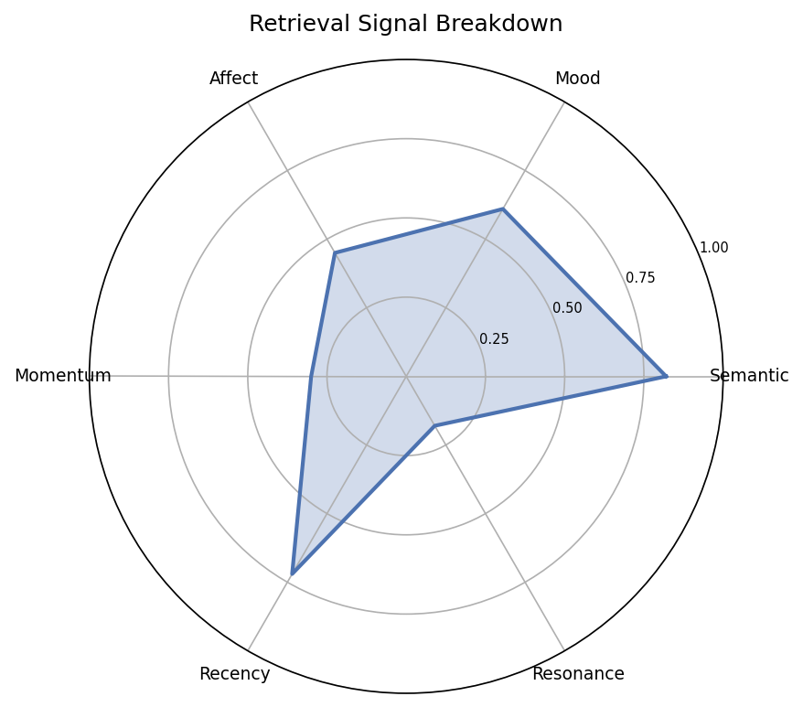
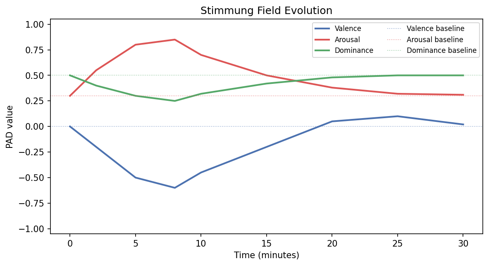
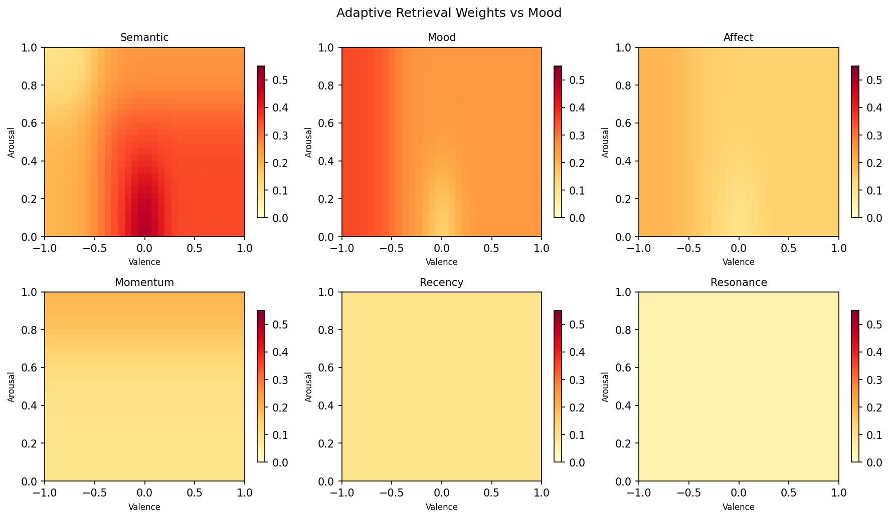
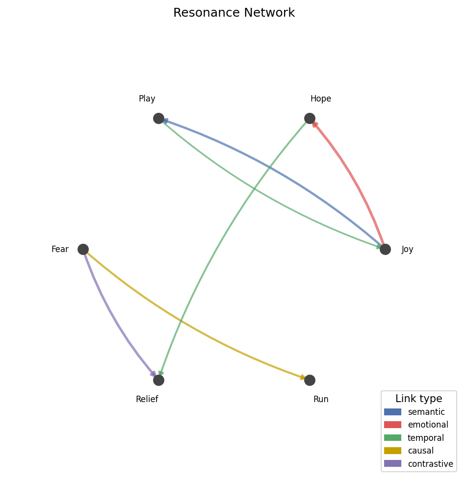
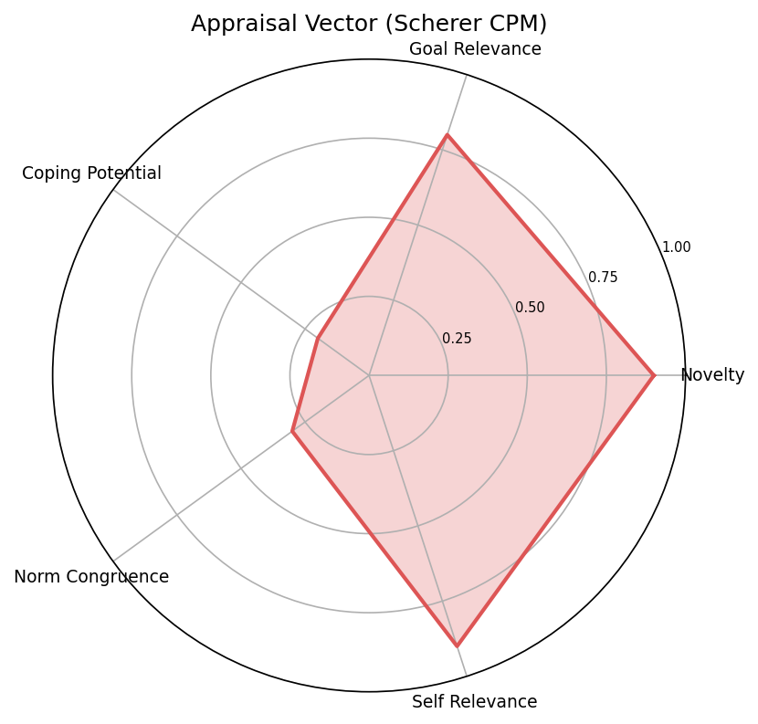

# emotional_memory

[](https://github.com/gianlucamazza/emotional-memory/actions/workflows/ci.yml)
[](https://pypi.org/project/emotional_memory/)
[](https://pypi.org/project/emotional_memory/)
[](LICENSE)

Emotional memory for LLMs based on **Affective Field Theory (AFT)** — a 5-layer model that encodes not just *what* happened, but *how it felt*, *how that feeling was moving*, and *what mood colored the moment*.

## Installation

```bash
pip install emotional-memory
pip install emotional-memory[sqlite]   # with SQLite persistence
pip install emotional-memory[viz]      # with matplotlib visualization
```

For development:

```bash
git clone https://github.com/gianlucamazza/emotional-memory
cd emotional-memory
pip install -e ".[dev,sqlite]"
pip install -e ".[dev,llm-test]"  # add httpx for real-LLM tests
pip install -e ".[dev,viz]"       # add matplotlib for visualization
```

## Quickstart

```python
from emotional_memory import (
    EmotionalMemory, EmotionalMemoryConfig,
    InMemoryStore, CoreAffect, AppraisalVector,
)

# Bring your own embedder — anything with .embed(text) -> list[float]
class MyEmbedder:
    def embed(self, text: str) -> list[float]: ...
    def embed_batch(self, texts: list[str]) -> list[list[float]]: ...

em = EmotionalMemory(store=InMemoryStore(), embedder=MyEmbedder())

# Set current emotional state
em.set_affect(CoreAffect(valence=0.8, arousal=0.6))

# Encode memories — each one captures the full affective context
em.encode("Just shipped the feature after three hard weeks.")
em.encode("Team celebration in the office.", metadata={"source": "slack"})

# Retrieve — ranked by semantic relevance AND emotional congruence
results = em.retrieve("difficult project success", top_k=3)
for mem in results:
    print(mem.content, mem.tag.core_affect)
```

### Async

```python
import asyncio
from emotional_memory import EmotionalMemory, InMemoryStore, as_async

sync_em = EmotionalMemory(store=InMemoryStore(), embedder=MyEmbedder())
em = as_async(sync_em)  # wraps sync components with asyncio.to_thread bridges

async def main():
    await em.encode("Meeting went surprisingly well today.")
    results = await em.retrieve("work meeting", top_k=3)

asyncio.run(main())
```

For native async embedders or stores, construct `AsyncEmotionalMemory` directly with
`SyncToAsyncEmbedder`, `SyncToAsyncStore`, or your own `AsyncEmbedder`/`AsyncMemoryStore`.

## Affective Field Theory

AFT models emotion as a **field** — distributed, dynamic, multi-layer — rather than a discrete label or a single coordinate. Five layers are captured at encoding time:

| Layer | Model | What it captures |
|---|---|---|
| **CoreAffect** | Barrett/Russell circumplex | Continuous `(valence, arousal)` — the emotional substrate |
| **AffectiveMomentum** | Spinoza — affect as transition | Velocity and acceleration of affect change |
| **StimmungField** | Heidegger — *Stimmung* as attunement | Slow-moving global mood with inertia (EMA) |
| **AppraisalVector** | Scherer/Lazarus/Stoics | Emotion derived from evaluation: novelty, goal-relevance, coping, norm-congruence, self-relevance |
| **ResonanceLinks** | Aristotle/Hume/Bower | Associative graph: semantic, emotional, temporal, causal, contrastive links |

Full theoretical foundations: [`docs/research/`](docs/research/)

## API Overview

### `EmotionalMemory`

```python
em = EmotionalMemory(
    store: MemoryStore,
    embedder: Embedder,
    appraisal_engine: AppraisalEngine | None = None,  # optional: auto-appraise via LLM
    config: EmotionalMemoryConfig | None = None,
)
```

| Method | Description |
|---|---|
| `encode(content, appraisal=None, metadata=None) -> Memory` | Encode content with full AFT pipeline |
| `encode_batch(contents, metadata=None) -> list[Memory]` | Batch encode with `embed_batch()`, per-item appraisal |
| `retrieve(query, top_k=5) -> list[Memory]` | Emotionally-weighted retrieval + reconsolidation |
| `delete(memory_id)` | Remove a memory from the store |
| `get(memory_id) -> Memory \| None` | Look up a single memory by ID |
| `list_all() -> list[Memory]` | Return all stored memories |
| `len(engine) -> int` | Number of memories in the store |
| `get_state() -> AffectiveState` | Current affective state (read-only copy) |
| `set_affect(core_affect)` | Manually inject a CoreAffect |
| `save_state() -> dict` | Serialise affective state for persistence |
| `load_state(data)` | Restore previously saved affective state |
| `get_current_stimmung(now=None) -> StimmungField` | Read-only Stimmung with time regression |

### `AsyncEmotionalMemory`

Same method signatures as `EmotionalMemory`, with `encode`, `retrieve`, `encode_batch`, and
`delete` as coroutines. State accessors (`get_state`, `set_affect`, `save_state`, `load_state`,
`get_current_stimmung`) remain synchronous.

```python
from emotional_memory import AsyncEmotionalMemory, SyncToAsyncEmbedder, SyncToAsyncStore
```

Bridge adapters: `SyncToAsyncEmbedder`, `SyncToAsyncStore`, `SyncToAsyncAppraisalEngine` wrap
any sync implementation. `as_async(engine)` wraps a complete `EmotionalMemory` in one call.

### Key config classes

- `EmotionalMemoryConfig` — top-level config (decay, retrieval, resonance, stimmung alpha, stimmung decay)
- `RetrievalConfig` — weights, APE threshold, reconsolidation learning rate
- `ResonanceConfig` — similarity threshold, max links, semantic/emotional/temporal weights, candidate multiplier
- `DecayConfig` — power-law decay parameters, arousal modulation, floor values
- `StimmungDecayConfig` — time-based Stimmung regression (half-life, inertia scale, baselines)
- `AdaptiveWeightsConfig` — smooth Stimmung-adaptive retrieval weight tuning (sigmoid/Gaussian gates)
- `LLMAppraisalConfig` — LLM appraisal engine settings (system prompt, cache size, fallback behaviour)

### Interfaces (bring your own)

```python
class Embedder(Protocol):
    def embed(self, text: str) -> list[float]: ...
    def embed_batch(self, texts: list[str]) -> list[list[float]]: ...

class MemoryStore(Protocol):
    def save(self, memory: Memory) -> None: ...
    def get(self, memory_id: str) -> Memory | None: ...
    def update(self, memory: Memory) -> None: ...
    def delete(self, memory_id: str) -> None: ...
    def list_all(self) -> list[Memory]: ...
    def search_by_embedding(self, embedding: list[float], top_k: int) -> list[Memory]: ...
    def __len__(self) -> int: ...
```

Async variants (`AsyncEmbedder`, `AsyncMemoryStore`, `AsyncAppraisalEngine`) are defined in
`interfaces_async.py`. `AsyncMemoryStore` uses `count() -> int` instead of `__len__` since
dunder methods cannot be coroutines.

**Stores included:**
- `InMemoryStore` — dict-backed, brute-force cosine search (no extra deps)
- `SQLiteStore` — persistent SQLite + sqlite-vec ANN search (`pip install emotional-memory[sqlite]`)

### Appraisal Engines

```python
class AppraisalEngine(Protocol):
    def appraise(self, event_text: str, context: dict | None = None) -> AppraisalVector: ...
```

Pass an `appraisal_engine` to `EmotionalMemory` to auto-generate `AppraisalVector` during encode.

**`LLMAppraisalEngine`** — wrap any LLM SDK in a single callable:

```python
from emotional_memory import LLMAppraisalEngine

def my_llm(prompt: str, json_schema: dict) -> str:
    # call openai / anthropic / local model here
    return response_text

engine = LLMAppraisalEngine(llm=my_llm)
em = EmotionalMemory(store=..., embedder=..., appraisal_engine=engine)
```

**`KeywordAppraisalEngine`** — regex-based fallback, zero external dependencies, ships with
default rules covering success, failure, novelty, danger, and social norms:

```python
from emotional_memory import KeywordAppraisalEngine
engine = KeywordAppraisalEngine()  # or pass custom KeywordRule list
```

## Visualization

The optional `viz` extra provides 8 plotting functions for inspecting and presenting the model's internals. Each function accepts an optional `ax` parameter for subplot composition and returns a `matplotlib.Figure`.

```python
from emotional_memory.visualization import plot_circumplex, plot_decay_curves
```

### Valence-Arousal Circumplex

Memories plotted on Russell's (1980) 2D circumplex, colored by consolidation strength.



### Decay Curves (ACT-R Power Law)

Family of curves showing how arousal (McGaugh 2004) and retrieval count (spacing effect) modulate memory decay.



### Yerkes-Dodson Inverted-U

Consolidation strength peaks near effective arousal 0.7, then drops — the classic Yerkes-Dodson curve.



### 6-Signal Retrieval Breakdown

Radar chart of the six retrieval signals: semantic similarity, Stimmung congruence, affect proximity, momentum alignment, recency, and resonance boost.



### Stimmung Field Evolution

Time series of valence, arousal, and dominance with dashed baselines showing the regression attractors.



### Adaptive Retrieval Weights

Heatmap showing how retrieval weights shift across different Stimmung states (valence x arousal grid).



### Resonance Network

Directed graph with memories as nodes and edges colored by link type (semantic, emotional, temporal, causal, contrastive).



### Appraisal Radar (Scherer CPM)

Spider chart of the 5 Stimulus Evaluation Check dimensions.



### Generating images

```bash
make docs-images   # regenerate all PNGs in docs/images/
```

## Benchmarks

### Psychological fidelity (77 tests)

The library validates 10 phenomena from the affective science literature:

| Phenomenon | Reference | Tests |
|---|---|---|
| Mood-congruent recall | Bower 1981 | 3 |
| Emotional enhancement | Cahill & McGaugh 1995 | 3 |
| Yerkes-Dodson inverted-U | Yerkes & Dodson 1908 | 12 |
| Spacing effect | Ebbinghaus 1885 | 7 |
| Arousal floor | McGaugh 2004 | 7 |
| Reconsolidation (APE) | Nader & Schiller 2000 | 5 |
| State-dependent retrieval | Godden & Baddeley 1975 | 3 |
| Affective momentum | Spinoza, Ethics III | 9 |
| Stimmung-adaptive weights | Heidegger, Being & Time §29 | 14 |
| Appraisal-to-affect mapping | Scherer CPM 2009 | 11 |

Run with: `make bench-fidelity`

### Performance (hash-based embedder, InMemoryStore)

| Operation | N | Mean | OPS |
|---|---|---|---|
| Encode (single) | 1 | 59 ms | 17/s |
| Encode (batch of 100) | 100 | 12 ms/op | 84/s |
| Encode (batch of 1 000) | 1 000 | 70 ms/op | 14/s |
| Resonance build | 50 | 1.7 ms | 587/s |
| Resonance build | 200 | 6.9 ms | 145/s |
| Resonance build | 500 | 17.6 ms | 57/s |
| Retrieve top-5 | 100 | 4.8 ms | 210/s |
| Retrieve top-5 | 1 000 | 28.6 ms | 35/s |
| Retrieve top-5 | 10 000 | 423 ms | 2.4/s |
| Retrieve (top-k 1–25) | 1 000 | 33–51 ms | 20–30/s |
| Retrieve + reconsolidation | 200 | 8.9 ms | 113/s |

Retrieval uses two-pass scoring (spreading activation), so latency scales linearly
with store size. For stores > 1 000 memories, implement `search_by_embedding` on
your `MemoryStore` to benefit from the pre-filter (`candidate_multiplier`).

Run with: `make bench-perf`

### Appraisal quality (LLM prompt validation)

15 natural-language phrases with expected directional outcomes against Scherer's 5 dimensions:

| Phrase category | Key assertions |
|---|---|
| Personal loss ("I got fired") | `goal_relevance < -0.2`, `coping_potential < 0.6` |
| Achievement ("Got promoted") | `goal_relevance > 0.2`, `norm_congruence > 0.0` |
| Moral violation ("Coworker stole credit") | `norm_congruence < -0.2`, `goal_relevance < 0.0` |
| Grief, danger, betrayal, relief, … | dimension-specific directional bounds |

Assertions use wide bands (e.g. `> 0.3`, `< -0.2`) and evaluate the median over 3 LLM calls to tolerate non-determinism. Designed to catch systematic prompt regressions, not exact calibration.

Run with: `EMOTIONAL_MEMORY_LLM_API_KEY=... make bench-appraisal`

Works with any OpenAI-compatible endpoint (Ollama, vLLM, LiteLLM, …) via `EMOTIONAL_MEMORY_LLM_BASE_URL`.

## Development

```bash
make check                    # lint + typecheck + test
make cov                      # tests with branch coverage report
make bench                    # fidelity + performance benchmarks

# Real-LLM tests (require API key):
make test-llm                 # end-to-end integration tests
make bench-appraisal          # Scherer CPM prompt quality benchmarks
```

### LLM test environment variables

| Variable | Default | Purpose |
|---|---|---|
| `EMOTIONAL_MEMORY_LLM_API_KEY` | — | API key (required) |
| `EMOTIONAL_MEMORY_LLM_BASE_URL` | `https://api.openai.com/v1` | OpenAI-compatible endpoint |
| `EMOTIONAL_MEMORY_LLM_MODEL` | `gpt-4o-mini` | Model |
| `EMOTIONAL_MEMORY_LLM_REPEATS` | `3` | Repeats per phrase in quality benchmarks |

## License

MIT — see [LICENSE](LICENSE)
