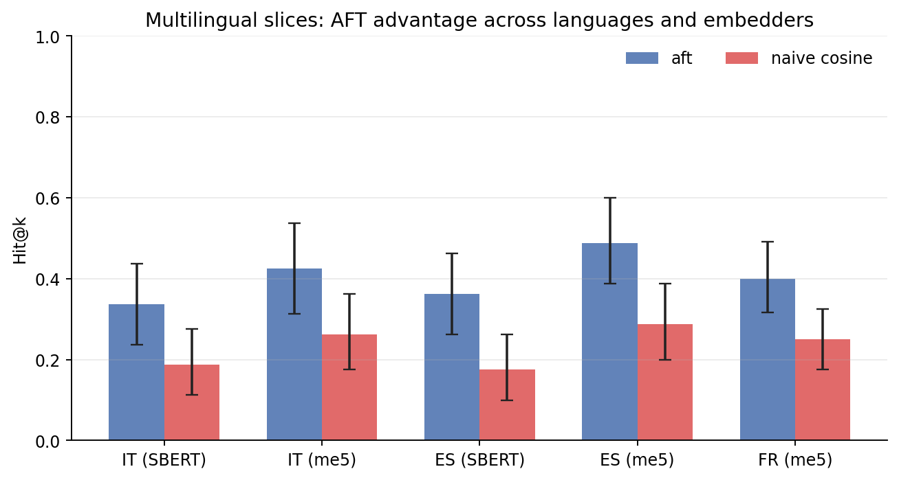

# Current Evidence and Study Ladder

This page summarizes what the project currently supports, what is validated, and
which study steps come next. It is meant to keep implementation status, public
claims, and research ambition aligned.

---

## Study ladder

The project now uses a five-step evidence ladder:

1. **Theory fidelity**: does the implementation behave coherently with the
   psychological/computational theory it encodes?
2. **Controlled retrieval behavior**: does the retrieval engine change ranking
   in the intended affect-aware direction under a constrained protocol?
3. **Appraisal quality**: does the appraisal layer produce directionally useful
   outputs on natural-language inputs?
4. **Realistic memory tasks**: does the system help on multi-session, agent-like
   scenarios where memory must persist and update over time?
5. **Human / ecological validation**: do humans perceive better affective
   coherence or utility, and does the behavior track human-like emotional memory
   in realistic settings?

Current repo strength is concentrated in steps **1–4**. Step **4** now has
controlled evidence: the v2 realistic replay benchmark (N=200, 5 challenge
types × 40) shows a decisive advantage over `naive_cosine` on both SBERT and
e5-small-v2 embedders. Step **5** remains open research work.

---

## Claim matrix

Canonical source: [`claim_validation_matrix.json`](claim_validation_matrix.json).
This JSON file is the repo's versioned source of truth for claim wording,
evidence level, and still-open gaps.

**Status legend**

- `Implemented`: present in the codebase, but not externally validated as
  valuable.
- `Controlled evidence`: supported under a narrow, documented benchmark
  protocol.
- `Strong intra-theory evidence`: strongly supported inside the theory the
  implementation operationalizes.
- `Early controlled evidence`: initial task or appraisal evidence exists, but
  remains narrow.
- `Not established`: not supported by current public evidence.

| ID | Claim area | Status | Evidence level | Allowed public wording | Current evidence | Not yet shown | Next study |
|---|---|---|---|---|---|---|---|
| `aft_multilayer_engine` | Architecture | Implemented | `1_theory_fidelity` | AFT is implemented as a coherent multi-layer memory engine. | Public API, engine/retrieval/state modules, sync/async parity tests. | External validation of architectural value. | Keep API/docs aligned while external evaluations grow. |
| `retrieval_affect_aware` | Retrieval behavior | Controlled evidence | `2_controlled_retrieval` | Retrieval is affect-aware, not semantic-only. | 126 fidelity cases validate affect-aware ranking logic. The controlled quadrant benchmark (SBERT) ties AFT and naive_cosine at recall@5 = 0.80 (ceiling effect, N = 20 items) while clearly beating recency (Δ = −0.55, p < 0.001). The realistic replay v2 benchmark shows AFT top1 = 0.53 vs naive_cosine = 0.33 with SBERT (N = 200; Δ=+0.205 [0.150,0.265], p_bootstrap<0.001) and 0.50 vs 0.34 with e5-small-v2 (Δ=+0.155 [0.090,0.225], p_bootstrap<0.001). Hd2 confirms architecture-level advantage on v2 and Italian cross-language; S3 shows no single layer is isolatably responsible. | General downstream superiority over production memory systems. | Expand external and realistic retrieval evaluations. |
| `theory_faithful_operationalization` | Theory fidelity | Strong intra-theory evidence | `1_theory_fidelity` | The implementation is faithful to the theories it operationalizes. | 126 fidelity cases across 20 phenomena validate expected intra-theory behavior. S3 ablation (N=200, SBERT and e5-small-v2) covers all 7 AFT mechanisms; the 8-variant ablation shows system-level advantage but no isolatable single-layer attribution. Hi3 PASS (Addendum I closure, 2026-05-06, N=500): cross-embedder amplification on `semantic_confound` confirmed (Δ=+0.090, d=0.257, p_adj=0.0234); Hi3_recency PASS; Hi3_arc FAIL. | Ecological correspondence to human emotional memory. LLM-appraisal dual-path advantage (requires non-destructive appraisal dataset; Addendum G pending). Hi2 mechanism for amplification not localised at link-count instrumentation level. | Human and behavioral validation. Addendum G: dual-path ablation with LLMAppraisalEngine on dataset without preset affect injection. |
| `appraisal_directionally_useful` | Appraisal quality | Early controlled evidence | `3_appraisal_quality` | Appraisal is directionally useful. | The appraisal-quality benchmark provides early controlled evidence on natural-language inputs. | Calibration across models, domains, and languages. | Appraisal robustness study across models, domains, and languages. |
| `replayable_multi_session_help` | Realistic tasks | Controlled evidence | `4_realistic_tasks` | AFT helps on replayable multi-session memory tasks (v2, N=200, SBERT: AFT top1=0.53 vs naive_cosine=0.33, Δ=+0.21 [0.15,0.27], p<0.001; e5-small-v2: AFT top1=0.50 vs 0.34, Δ=+0.16 [0.09,0.22], p<0.001). | Realistic replay v2 (50 scenarios, 200 queries, 5 challenge types × 40). SBERT bge-small-en: AFT top1=0.53 vs naive_cosine=0.33, Δ=+0.205 [0.150,0.265], p_bootstrap<0.001, d=0.49. e5-small-v2: AFT top1=0.50 vs naive_cosine=0.34, Δ=+0.155 [0.090,0.225], p_bootstrap<0.001, d=0.31. Advantage holds on both embedder classes. Architecture attribution confirmed: Hd1 PASS (Addendum D, seed=1, 2026-04-27); Gate 3 CLOSED. | General superiority on external open-domain QA (LoCoMo Gate 1 FAIL — AFT F1=0.168 vs naive_rag=0.271; Add. J Pareto sweep Hj1 FAIL — base_weights tuning cannot close the gap) or completed human/ecological validation. | Execute human-evaluation pilot. |
| `locomo_external_qa_negative` | External benchmarks | Controlled evidence | `4_realistic_tasks` | On the LoCoMo conversational QA benchmark (1986 QA pairs), AFT retrieval underperforms a naive RAG baseline (F1 0.168 vs 0.271; Gate 1 not met). | Pre-registered S1 run completed 2026-04-27. H1 and H2 both fail (Δ<0, p_one=1.0). Add. J Pareto sweep (2026-05-06): 10 weight configs × 200-QA subsample, Hj1 FAIL — no config matches naive_rag on any category. Best: W2 aggregate F1=0.1765 vs naive_rag=0.2092. Per-task base_weights tuning line closed. | Whether architectural changes (per-category routing, query-type classifier) could close the gap. base_weights tuning alone cannot match naive_rag. | Architectural approaches; full-N W2 replication not warranted (Hj1 FAIL). |
| `resonance_amplification_e5` | Retrieval behavior | Controlled evidence | `2_controlled_retrieval` | Hi3 PASS (N=500, seed=1): e5-small-v2 shows larger resonance interference than SBERT on semantic_confound queries (Δ=+0.090 [0.030,0.160], d=0.257, Holm-adj p=0.0234). The v2 per-challenge finding (post-hoc Δ=+0.100) is confirmed as not a sample-size artefact. | Hi3 confirmatory, Addendum I closure (2026-05-06). Holm m=3 family, paired bootstrap n=10,000 seed=1. Primary PASS: Δ=0.090, d=0.257. | Mechanism: link-count instrumentation shows both embedders saturate top-5 cap (mean≈5.0); Hi2 spreading-activation over-fire hypothesis not yet localised. | Link-type/strength instrumentation to localise the Hi2 mechanism channel. |
| `Hi3_recency` | Retrieval behavior | Controlled evidence | `2_controlled_retrieval` | Hi3_recency PASS (secondary, Holm-corrected): e5 resonance interference exceeds SBERT on recency_confound queries (Δ=+0.070 [0.020,0.130], d=0.239, Holm-adj p=0.0234, N=500). | Hi3_recency secondary PASS in Holm m=3 family (Addendum I closure, 2026-05-06): Δ=0.070, CI=[0.020,0.130], p_adj=0.0234, d=0.239. | Mechanism; replication on independent dataset. | Contingent on Hi3 mechanism study. |
| `Hi3_arc` | Retrieval behavior | Not established | `2_controlled_retrieval` | Hi3_arc FAIL: no significant amplification on affective_arc queries (Δ=+0.010 [-0.020,0.050], d=0.058, Holm-adj p=0.3795, N=500). The embedder gap does not extend to affective_arc at this sample size. | Hi3_arc secondary FAIL (Addendum I closure, 2026-05-06): Δ=0.010, p_adj=0.3795, d=0.058. Embedder amplification scoped to semantic_confound and recency_confound. | Whether larger N or different dataset would show signal. | No active follow-up; Hi3_arc FAIL scopes the amplification claim. |
| `models_human_emotional_memory` | Ecological validity | Not established | `5_human_ecological` | The system is theory-inspired, but does not yet have human or ecological validation. | Theory-inspired design only. | Human behavioral correspondence. | Pilot human evaluation with completed ratings and external benchmarks. |
| `realistic_replay_vs_sota` | Retrieval behavior vs SOTA | Controlled evidence | `4_realistic_tasks` | On the realistic multi-session replay benchmark, AFT with preset affect labels achieves top1_accuracy = 0.535 vs Mem0 = 0.330 and LangMem = 0.365 — an advantage of Δ +0.21 (d=0.51) with non-overlapping 95% CIs. Neither LLM-backed system outperforms naive cosine on this benchmark. | H_v2_sota PASS (exploratory, 2026-05-07, gpt-4.1-mini, sbert-bge, N=200, n_bootstrap=10000, seed=0). AFT top1=0.535 vs Mem0=0.330 and LangMem=0.365; both SOTA systems below naive_cosine=0.325. | Advantage without oracle-affect (Hg1 FAIL). Advantage on factual QA (LoCoMo S1 FAIL). | SOTA replication with automatic appraisal engine (would require non-circular affect-free dataset). |
| `appraisal_llm_real_dual_path` | Appraisal quality | Not established | `3_appraisal_quality` | Hg1 FAIL: AFT with LLMAppraisalEngine (dual-path, gpt-5-mini) does not outperform naive cosine on N=200 affect-free queries (Δ=-0.010 [-0.055, 0.035], d=-0.032, p_one=0.367). The oracle-affect circularity remains the scope boundary of the Hd1/Hd2 claims. | Addendum G closure 2026-05-07: realistic_recall_v3_noAF (50 scenarios, 200 queries), sbert-bge embedder, oracle-free. Hg1 FAIL. | Whether larger N, stronger LLM, or different dataset would show signal. | Larger N replication (N≥400) or stronger LLM appraisal. |

---

## What is strongest today

- **Strongest evidence**: theory-fidelity benchmarks. These are the clearest
  proof that the code behaves as designed.
- **Second-best evidence**: realistic replay v2 benchmark (N=200, 5 challenge
  types × 40). SBERT bge-small: AFT top1=0.53 vs naive_cosine=0.33,
  Δ=+0.205 [0.150,0.265], p_bootstrap<0.001, d=0.49. e5-small-v2: AFT
  top1=0.50 vs 0.34, Δ=+0.155 [0.090,0.225], p_bootstrap<0.001, d=0.31.
  The advantage holds on both SBERT and e5-small-v2 (two distinct
  embedder classes), addressing G5. The controlled quadrant probe
  (`affect_reference_v1`) ties AFT and naive_cosine at SBERT ceiling (both 0.80)
  but confirms the benchmark discriminates clearly against the recency baseline.
- **Useful but narrow evidence**: appraisal-quality checks and demo-level
  product behavior.
- **Step-4 evidence upgraded to controlled**: v2 (50 scenarios, 200 queries)
  shows decisive aggregate advantage on both embedder classes. Per-challenge
  breakdown (SBERT): semantic_confound 0.72 vs 0.47, affective_arc 0.42 vs 0.15,
  momentum_alignment 0.60 vs 0.33, same_topic_distractor 0.75 vs 0.62,
  recency_confound 0.15 vs 0.05. Hd2 confirms the architecture-level advantage;
  S3 shows that the advantage is not isolatable to a single AFT layer.
- **Negative external result (Gate 1, 2026-04-27)**: On the LoCoMo conversational QA benchmark (1986 QA pairs, 10 conversations), AFT retrieval underperforms a naive RAG baseline (F1 0.168 vs 0.271; judge_acc 0.279 vs 0.441). Gate 1 was not met. AFT's affective weighting does not help on factual open-domain QA. **Add. J Pareto sweep (2026-05-06, Hj1 FAIL)**: 10 weight configs × 200-QA stratified subsample — no config matches naive_rag on any category. Best: W2 aggregate F1=0.1765 vs naive_rag=0.2092. Per-task `base_weights` tuning line closed. See `locomo_external_qa_negative` in `claim_validation_matrix.json`.
- **Study-readiness improvement**: the human-eval pilot is now operationally
  specified as a 10-scenario, 2-condition (`aft` vs `naive_cosine`) protocol,
  but still awaits real completed ratings.

---

## What should come next

The next recommended studies, in order:

1. **Protocol upgrade for comparative retrieval**
   Standardize metadata, assumptions, and reporting for the existing benchmark.
2. ~~**Expand the realistic replay benchmark**~~
   *Completed (v2.0): 50 scenarios / 200 queries; decisive advantage on SBERT
   and e5-small-v2 (both p_bootstrap<0.001). G4 + G5 addressed.*
3. **Execute the human-eval pilot with completed ratings**
   Collect ratings on coherence, usefulness, continuity, and plausibility from
   at least 3 raters (Krippendorff's alpha is wired and reported automatically
   when `ratings.jsonl` is filled).
4. ~~**Run LoCoMo end-to-end for external benchmark validation**~~
   *Completed 2026-04-27 (Gate 1 FAIL): `benchmarks/locomo/results.json` committed.
   AFT F1=0.168 vs naive_rag F1=0.271 on 1986 QA pairs; both H1 and H2 fail
   Holm correction. Negative result — affective weighting does not improve
   open-domain factual QA. Claim ceiling unchanged; see `locomo_external_qa_negative`
   in `claim_validation_matrix.json`.*

---

## S3 + Hd2 Closure (2026-05-04)

### Study S3 — Layer Ablation @ N=200 (realistic_recall_v2)

Result files: `benchmarks/ablation/results.v2.sbert.json`, `results.v2.e5.json`

| Variant | SBERT top1 | e5 top1 | SBERT Δ vs full | e5 Δ vs full | S3 verdict |
|---|---|---|---|---|---|
| full | 0.54 | 0.51 | — | — | baseline |
| no_mood | 0.52 | 0.50 | -0.02 (NS) | -0.005 (NS) | Ha **FAIL** |
| no_resonance | 0.56 | 0.59 | +0.02 (NS) | +0.085 (**SIG**) | Hb **FAIL** |
| no_appraisal | 0.53 | 0.51 | -0.01 (NS) | +0.005 (NS) | Hc **PASS** (invariant) |
| no_momentum | 0.56 | 0.51 | +0.02 (NS) | 0.00 (NS) | Hd NS (exploratory) |
| dual_path | 0.34 | 0.24 | -0.20 (SIG) | -0.27 (SIG) | He1 replicated |
| no_reconsolidation | 0.54 | 0.53 | +0.01 (NS) | +0.03 (NS) | He2 null replicated |
| aft_keyword_synchronous | 0.09 | 0.06 | -0.45 (SIG) | -0.45 (SIG) | Hf1 replicated |

**Key finding:** Per-layer ablations (Ha, Hb) are NOT significant at power.
The resonance layer shows an unexpected *positive* effect with e5 (Hb FAIL,
opposite direction). The AFT architecture advantage is a system-level emergent
property; no single layer is isolatably responsible.

**Hf1 direct bootstrap (v2 secondary, n=10,000, seed=0):**

| Embedder | dual_path | aft_kw_sync | Δ_Hf1 [95% CI] | p (one-tailed) | Verdict |
|---|---|---|---|---|---|
| SBERT | 0.350 | 0.095 | +0.255 [0.190, 0.320] | <0.001 | **Hf1 PASS** |
| e5 | 0.235 | 0.070 | +0.165 [0.110, 0.225] | <0.001 | **Hf1 PASS** |

Primary Hf1 (v1.4, N=100): see `benchmarks/ablation/results.sbert.md`.

### Hd2 — Addendum D Generalization (realistic_recall_v2)

Result files: `benchmarks/appraisal_confound/results.hd2.sbert.json`, `results.hd2_it.me5.json`

| Study | Dataset/Embedder | N | Verdict | Δ (top1) | p | Cohen's d |
|---|---|---|---|---|---|---|
| Hd1 (primary) | v1 / SBERT | 100 | **PASS** | +0.230 | <0.001 | 0.515 |
| Hd2 (generalization) | v2 / SBERT | 200 | **PASS** | +0.125 | <0.001 | 0.286 |
| Hd2_IT (cross-language) | v2_it / me5 | 80 | PASS (raw) / borderline (family) | +0.163 | 0.012 | 0.289 |
| Hd2_ES (cross-language) | v2_es / SBERT | 80 | PASS (raw) | +0.138 | 0.045 | 0.233 |
| Hd2_ES (cross-language) | v2_es / me5 | 80 | FAIL | +0.113 | 0.110 | 0.189 |
| **Hd2_IT_v120 (power top-up)** | v2_it / me5 | **120** | **FAIL** | **+0.058** | **0.276** | **0.105** |
| **Hd2_ES_v120 (power top-up)** | v2_es / me5 | **120** | **FAIL** | **0.000** | **1.000** | **0.000** |

**Key finding (EN):** AFT architecture advantage (aft_noAppraisal > naive_cosine)
generalizes from v1 to v2 (smaller but above Δ>0.10 threshold). System-level
advantage is real; per-layer attribution is not (S3 above).

**Cross-language (Branch C):** Pre-registered power top-up to N=120 on
multilingual-e5-small (IT + ES) does not establish the effect for either language.
Cross-language evidence is scoped to a single exploratory Spanish-SBERT result at
N=80 (Δ=+0.138, p=0.045). See `benchmarks/preregistration_addendum_hd2_powertopup_closure.md`.

**FR realistic replay (Addendum M, Branch A PASS):** A sibling study using the `realistic.runner`
2-session design on a natively-authored French dataset (30 scenarios, 120 queries, me5) shows a
strong AFT advantage: Δ=+0.18 [0.11, 0.26], p<0.0001, Hedges g=0.424. This is a *different runner
and dataset format* from the Hd2 appraisal_confound runs above (single-session). Cross-language
evidence is conditionally established: the 2-session realistic replay format generalises to FR; the
single-session Hd2 format does not. See `benchmarks/preregistration_addendum_m_fr_closure.md`.

### Hm1 — French Multilingual Slice (Addendum M, Branch A PASS)

**Claim:** `cross_domain_affect_replication` — **controlled_evidence** (as of Addendum M, 2026-05-16)

Pre-reg: `benchmarks/preregistration_addendum_m_fr.md`
Closure: `benchmarks/preregistration_addendum_m_fr_closure.md`

| System | N | top1 [95% CI] | hit@k [95% CI] |
|---|---|---|---|
| `aft` | 120 | **0.31** [0.23, 0.39] | **0.40** [0.32, 0.49] |
| `naive_cosine` | 120 | 0.12 [0.07, 0.18] | 0.25 [0.17, 0.33] |
| `recency` | 120 | 0.21 [0.14, 0.28] | 0.48 [0.39, 0.57] |

| Metric | Δ [95% CI] | p_bootstrap | Hedges g | N discordant |
|---|---|---|---|---|
| top1 (AFT vs naive) | **+0.18 [0.11, 0.26]** | **0.0000** | **0.424** | 26 / 120 |
| hit@k (AFT vs naive) | +0.15 [0.09, 0.22] | 0.0000 | 0.416 | 18 / 120 |

**Branch A confirmed (pre-reg declared expected = FAIL).**

Hk1 FAIL (Branch B, 2026-05-07): DailyDialog ecological replication — AFT does not outperform naive cosine on naturalistic short-turn dialogue (N=120 personas, 396 queries, multilingual-e5-small; Δ=-0.008, p_holm=1.000). Addendum M FR PASS (Branch A, 2026-05-16): native French scenarios, 2-session realistic replay (N=120, me5); AFT top1=0.31 vs naive_cosine=0.12, Δ=+0.18 [0.11, 0.26], p<0.0001, Hedges g=0.424.

Per challenge type (AFT top1): affective_arc 0.38, same_topic_distractor 0.42, recency_confound 0.29,
semantic_confound 0.33, momentum_alignment 0.12. Momentum_alignment remains weak across all
languages tested.

### Hk1 — DailyDialog Ecological Replication (Branch B)

**Claim:** `cross_domain_affect_replication` — **controlled_evidence** (Hm1 FR PASS closes retry_planned)

Hk1 FAIL (Branch B, 2026-05-07): AFT does not outperform naive cosine on DailyDialog affect-conditioned retrieval (N=120 personas, 396 queries, multilingual-e5-small; Δ=-0.008, p_holm=1.000, d=-0.015). The realistic-recall advantage is regime-specific (curated affective benchmarks) and does not extend to naturalistic short-turn dialogue.

Result files: `benchmarks/dailydialog/results.{json,md,protocol.json}`
Pre-reg: `benchmarks/preregistration_addendum_k_dailydialog.md`
Closure: `benchmarks/preregistration_addendum_k_dailydialog_closure.md`

| Query type | N | AFT top1 | Cosine top1 | Δ | p_holm | d | Verdict |
|---|---|---|---|---|---|---|---|
| **aggregate** | **396** | **0.212** | **0.220** | **−0.008** | **1.000** | **−0.015** | **FAIL** |
| emotion_state_recall | 120 | 0.217 | 0.225 | −0.008 | 1.000 | −0.017 | FAIL |
| affect_conditioned_content | 120 | 0.175 | 0.217 | −0.042 | 1.000 | −0.088 | FAIL |
| affective_trajectory | 39 | 0.385 | 0.282 | +0.103 | 0.734 | +0.186 | FAIL (N=39) |
| cross_session_control | 117 | 0.188 | 0.197 | −0.009 | 1.000 | −0.017 | FAIL |

**Branch B confirmed.** AFT does not outperform naive cosine on naturalistic
DailyDialog at N=120. The `affective_trajectory` positive trend (d=0.186) is
an exploratory signal, not a confirmatory PASS (underpowered, p_holm=0.734).
Consistent with LoCoMo FAIL: advantage is regime-specific to curated
affective benchmarks with dense emotion content.

---

## Power notes (ex-post)

Observed power estimates for results with d < 0.30 or p near α, using the
one-tailed paired t-test approximation `power = Φ(d·√N − z_α)` with z_α = 1.645
(α=0.05). These are approximate — the actual tests use paired bootstrap on binary
vectors, not t-tests.

| Study | N | d (Cohen) | ~Power | Interpretation |
|---|---|---|---|---|
| Hd2 EN SBERT | 200 | 0.286 | ~99% | Adequately powered |
| Hd2_IT me5 | 80 | 0.289 | ~83% | Moderately powered |
| Hd2_ES SBERT | 80 | 0.233 | ~67% | Borderline; result significant but narrow margin |
| Hd2_ES me5 | 80 | 0.189 | ~52% | Underpowered for this d; FAIL plausibly Type II |
| Hd2_IT me5 (v120) | 120 | 0.105 | ~38% | Executed at declared power: FAIL; d collapsed vs N=80 |
| Hd2_ES me5 (v120) | 120 | 0.000 | ~5% | Executed at declared power: FAIL; Δ=0.000 (exact null) |
| Hm1 FR me5 (realistic.runner) | 120 | 0.424 | >99% | Branch A PASS; strong effect, well-powered |
| S2 H4 affective_arc SBERT | 40 | ~0.55 (est.) | ~97% | Adequately powered |
| S2 H5 recency_confound SBERT | 40 | ~0.20 (est.) | ~35% | Underpowered; marginal FAIL expected |
| S2 H6 momentum_alignment e5 | 40 | ~0.01 (est.) | ~5% | Near-zero true effect or incompatible geometry |

**Implications:**
- Hd2_ES me5 FAIL (p=0.110) at N=80 was consistent with Type II error (d≈0.19 at N=80 → ~52% power). Pre-registered power top-up to N=120 was executed (2026-05-07): Δ=0.000, p=1.00. The original miss was not Type II; the true d is near zero at this test configuration.
- S2 H5 recency_confound (SBERT) at N=40 is substantially underpowered. The marginal
  p_adj=0.054 is consistent with a real but small effect (d≈0.20). Confirming H5 would
  require N≥100 per challenge type.
- S2 H6 momentum_alignment (e5) shows near-zero effect (Δ=0.025), suggesting the
  signal is absent for this embedder rather than underpowered.
- Results with high power (Hd2 EN SBERT, H3, H4) are robust to replication.

---

## Evidence figures

These figures are generated from the committed benchmark JSON artefacts with
`make research-figures`; they do not rerun long benchmark jobs.

---

## Reading guide

- For the theoretical motivation: [Design Principles](05_design_principles.md)
- For neighboring systems: [State of the Art](04_state_of_art.md) and
  [Related Work](07_related_work.md)
- For known limitations: [Limitations](08_limitations.md)
