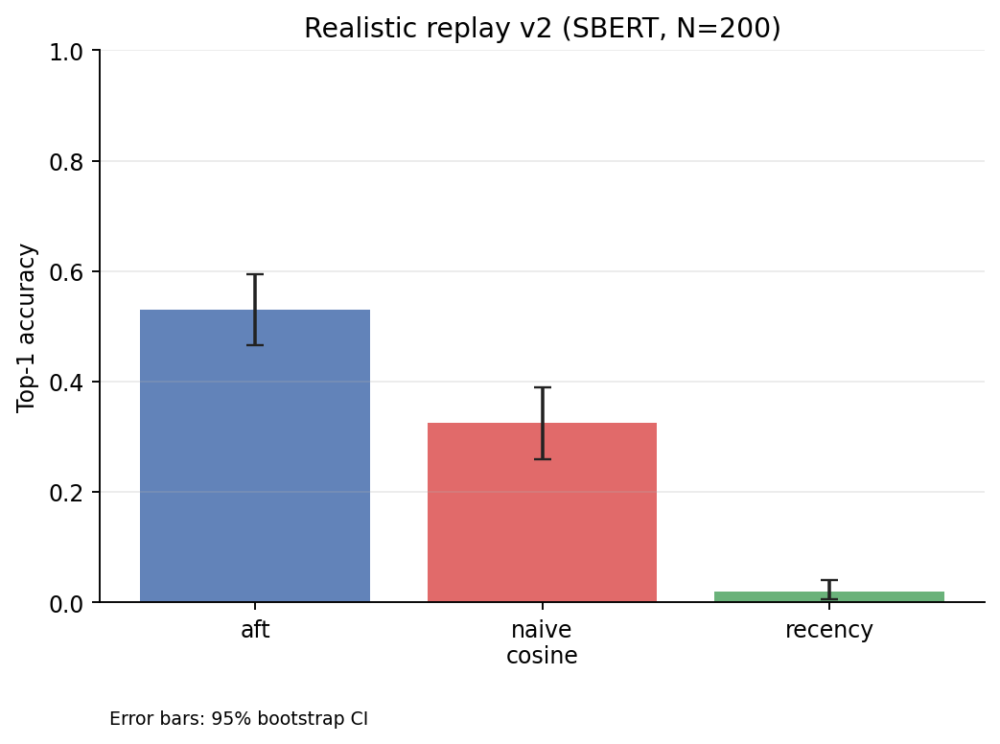
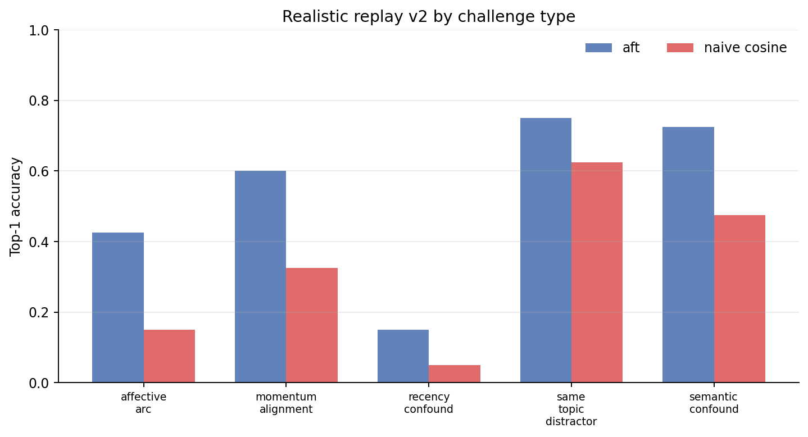
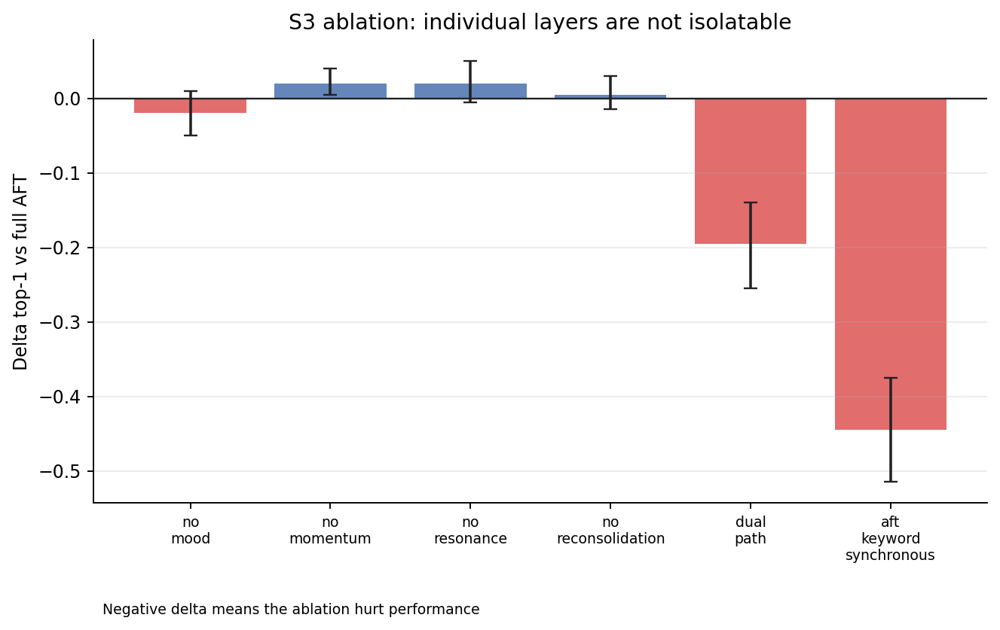
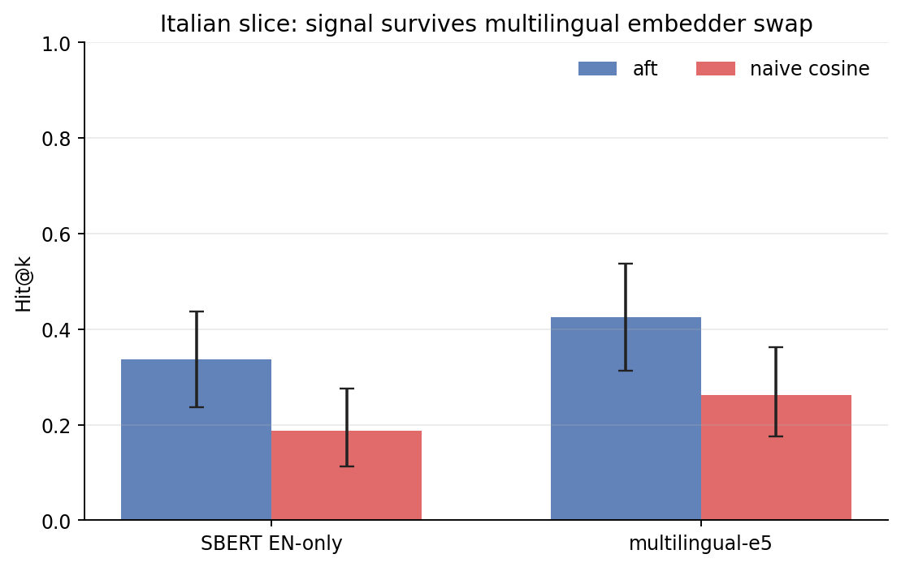
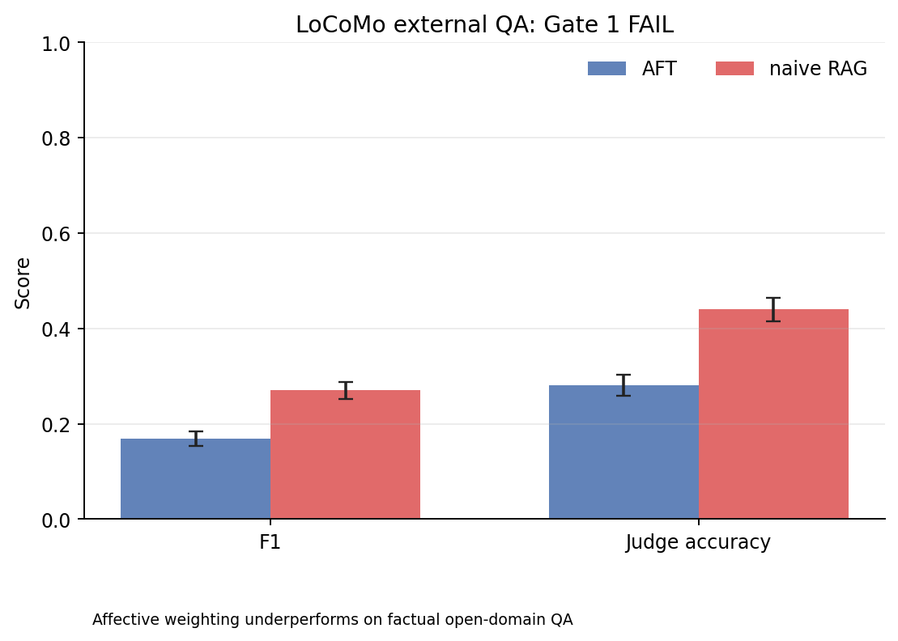

# Current Evidence and Study Ladder

This page summarizes what the project currently supports, what is validated, and
which study steps come next. It is meant to keep implementation status, public
claims, and research ambition aligned.

---

## Study ladder

The project now uses a five-step evidence ladder:

1. **Theory fidelity**: does the implementation behave coherently with the
   psychological/computational theory it encodes?
2. **Controlled retrieval behavior**: does the retrieval engine change ranking
   in the intended affect-aware direction under a constrained protocol?
3. **Appraisal quality**: does the appraisal layer produce directionally useful
   outputs on natural-language inputs?
4. **Realistic memory tasks**: does the system help on multi-session, agent-like
   scenarios where memory must persist and update over time?
5. **Human / ecological validation**: do humans perceive better affective
   coherence or utility, and does the behavior track human-like emotional memory
   in realistic settings?

Current repo strength is concentrated in steps **1–4**. Step **4** now has
controlled evidence: the v2 realistic replay benchmark (N=200, 5 challenge
types × 40) shows a decisive advantage over `naive_cosine` on both SBERT and
e5-small-v2 embedders. Step **5** remains open research work.

---

## Claim matrix

Canonical source: [`claim_validation_matrix.json`](claim_validation_matrix.json).
This JSON file is the repo's versioned source of truth for claim wording,
evidence level, and still-open gaps.

**Status legend**

- `Implemented`: present in the codebase, but not externally validated as
  valuable.
- `Controlled evidence`: supported under a narrow, documented benchmark
  protocol.
- `Strong intra-theory evidence`: strongly supported inside the theory the
  implementation operationalizes.
- `Early controlled evidence`: initial task or appraisal evidence exists, but
  remains narrow.
- `Not established`: not supported by current public evidence.

| ID | Claim area | Status | Evidence level | Allowed public wording | Current evidence | Not yet shown | Next study |
|---|---|---|---|---|---|---|---|
| `aft_multilayer_engine` | Architecture | Implemented | `1_theory_fidelity` | AFT is implemented as a coherent multi-layer memory engine. | Public API, engine/retrieval/state modules, sync/async parity tests. | External validation of architectural value. | Keep API/docs aligned while external evaluations grow. |
| `retrieval_affect_aware` | Retrieval behavior | Controlled evidence | `2_controlled_retrieval` | Retrieval is affect-aware, not semantic-only. | 126 fidelity cases validate affect-aware ranking logic. The controlled quadrant benchmark (SBERT) ties AFT and naive_cosine at recall@5 = 0.80 (ceiling effect, N = 20 items) while clearly beating recency (Δ = −0.55, p < 0.001). The realistic replay v2 benchmark shows AFT top1 = 0.53 vs naive_cosine = 0.33 with SBERT (N = 200; Δ=+0.205 [0.150,0.265], p_bootstrap<0.001) and 0.50 vs 0.34 with e5-small-v2 (Δ=+0.155 [0.090,0.225], p_bootstrap<0.001). Hd2 confirms architecture-level advantage on v2 and Italian cross-language; S3 shows no single layer is isolatably responsible. | General downstream superiority over production memory systems. | Expand external and realistic retrieval evaluations. |
| `theory_faithful_operationalization` | Theory fidelity | Strong intra-theory evidence | `1_theory_fidelity` | The implementation is faithful to the theories it operationalizes. | 126 fidelity cases across 20 phenomena validate expected intra-theory behavior. S3 ablation (N=200, SBERT and e5-small-v2) covers all 7 AFT mechanisms: individual no_mood/no_resonance effects are not significant in the expected direction, dual_path and synchronous keyword variants are destructive, and no_reconsolidation remains null on this benchmark. The 8-variant ablation shows system-level advantage but no isolatable single-layer attribution. | Ecological correspondence to human emotional memory. LLM-appraisal dual-path advantage (requires non-destructive appraisal dataset; Addendum G future). | Human and behavioral validation. Addendum G: dual-path ablation with LLMAppraisalEngine on dataset without preset affect injection. |
| `appraisal_directionally_useful` | Appraisal quality | Early controlled evidence | `3_appraisal_quality` | Appraisal is directionally useful. | The appraisal-quality benchmark provides early controlled evidence on natural-language inputs. | Calibration across models, domains, and languages. | Appraisal robustness study across models, domains, and languages. |
| `replayable_multi_session_help` | Realistic tasks | Controlled evidence | `4_realistic_tasks` | AFT helps on replayable multi-session memory tasks (v2, N=200, SBERT: AFT top1=0.53 vs naive_cosine=0.33, Δ=+0.21 [0.15,0.27], p<0.001; e5-small-v2: AFT top1=0.50 vs 0.34, Δ=+0.16 [0.09,0.22], p<0.001). | Realistic replay v2 (50 scenarios, 200 queries, 5 challenge types × 40). SBERT bge-small-en: AFT top1=0.53 vs naive_cosine=0.33, Δ=+0.205 [0.150,0.265], p_bootstrap<0.001, d=0.49. e5-small-v2: AFT top1=0.50 vs naive_cosine=0.34, Δ=+0.155 [0.090,0.225], p_bootstrap<0.001, d=0.31. Advantage holds on both embedder classes. Architecture attribution confirmed: Hd1 PASS (Addendum D, seed=1, 2026-04-27); Gate 3 CLOSED. | General superiority on external open-domain QA (LoCoMo Gate 1 FAIL — AFT F1=0.168 vs naive_rag=0.271) or completed human/ecological validation. | Execute human-evaluation pilot; investigate per-task retrieval-weight tuning for factual QA. |
| `locomo_external_qa_negative` | External benchmarks | Controlled evidence | `4_realistic_tasks` | On the LoCoMo conversational QA benchmark (1986 QA pairs), AFT retrieval underperforms a naive RAG baseline (F1 0.168 vs 0.271; Gate 1 not met). | Pre-registered S1 run completed 2026-04-27. H1 and H2 both fail (Δ<0, p_one=1.0). | Whether task-specific retrieval weight tuning could close the gap. | Investigate per-task configuration; document as scope limitation in paper. |
| `models_human_emotional_memory` | Ecological validity | Not established | `5_human_ecological` | The system is theory-inspired, but does not yet have human or ecological validation. | Theory-inspired design only. | Human behavioral correspondence. | Pilot human evaluation with completed ratings and external benchmarks. |

---

## What is strongest today

- **Strongest evidence**: theory-fidelity benchmarks. These are the clearest
  proof that the code behaves as designed.
- **Second-best evidence**: realistic replay v2 benchmark (N=200, 5 challenge
  types × 40). SBERT bge-small: AFT top1=0.53 vs naive_cosine=0.33,
  Δ=+0.205 [0.150,0.265], p_bootstrap<0.001, d=0.49. e5-small-v2: AFT
  top1=0.50 vs 0.34, Δ=+0.155 [0.090,0.225], p_bootstrap<0.001, d=0.31.
  The advantage holds on both SBERT and e5-small-v2 (two distinct
  embedder classes), addressing G5. The controlled quadrant probe
  (`affect_reference_v1`) ties AFT and naive_cosine at SBERT ceiling (both 0.80)
  but confirms the benchmark discriminates clearly against the recency baseline.
- **Useful but narrow evidence**: appraisal-quality checks and demo-level
  product behavior.
- **Step-4 evidence upgraded to controlled**: v2 (50 scenarios, 200 queries)
  shows decisive aggregate advantage on both embedder classes. Per-challenge
  breakdown (SBERT): semantic_confound 0.72 vs 0.47, affective_arc 0.42 vs 0.15,
  momentum_alignment 0.60 vs 0.33, same_topic_distractor 0.75 vs 0.62,
  recency_confound 0.15 vs 0.05. Hd2 confirms the architecture-level advantage;
  S3 shows that the advantage is not isolatable to a single AFT layer.
- **Negative external result (Gate 1, 2026-04-27)**: On the LoCoMo conversational QA benchmark (1986 QA pairs, 10 conversations), AFT retrieval underperforms a naive RAG baseline (F1 0.168 vs 0.271; judge_acc 0.279 vs 0.441). Gate 1 was not met. AFT's affective weighting does not help on factual open-domain QA. See `locomo_external_qa_negative` in `claim_validation_matrix.json`.
- **Study-readiness improvement**: the human-eval pilot is now operationally
  specified as a 10-scenario, 2-condition (`aft` vs `naive_cosine`) protocol,
  but still awaits real completed ratings.

---

## What should come next

The next recommended studies, in order:

1. **Protocol upgrade for comparative retrieval**
   Standardize metadata, assumptions, and reporting for the existing benchmark.
2. ~~**Expand the realistic replay benchmark**~~
   *Completed (v2.0): 50 scenarios / 200 queries; decisive advantage on SBERT
   and e5-small-v2 (both p_bootstrap<0.001). G4 + G5 addressed.*
3. **Execute the human-eval pilot with completed ratings**
   Collect ratings on coherence, usefulness, continuity, and plausibility from
   at least 3 raters (Krippendorff's alpha is wired and reported automatically
   when `ratings.jsonl` is filled).
4. ~~**Run LoCoMo end-to-end for external benchmark validation**~~
   *Completed 2026-04-27 (Gate 1 FAIL): `benchmarks/locomo/results.json` committed.
   AFT F1=0.168 vs naive_rag F1=0.271 on 1986 QA pairs; both H1 and H2 fail
   Holm correction. Negative result — affective weighting does not improve
   open-domain factual QA. Claim ceiling unchanged; see `locomo_external_qa_negative`
   in `claim_validation_matrix.json`.*

---

## S3 + Hd2 Closure (2026-05-04)

### Study S3 — Layer Ablation @ N=200 (realistic_recall_v2)

Result files: `benchmarks/ablation/results.v2.sbert.json`, `results.v2.e5.json`

| Variant | SBERT top1 | e5 top1 | SBERT Δ vs full | e5 Δ vs full | S3 verdict |
|---|---|---|---|---|---|
| full | 0.54 | 0.51 | — | — | baseline |
| no_mood | 0.52 | 0.50 | -0.02 (NS) | -0.005 (NS) | Ha **FAIL** |
| no_resonance | 0.56 | 0.59 | +0.02 (NS) | +0.085 (**SIG**) | Hb **FAIL** |
| no_appraisal | 0.53 | 0.51 | -0.01 (NS) | +0.005 (NS) | Hc **PASS** (invariant) |
| no_momentum | 0.56 | 0.51 | +0.02 (NS) | 0.00 (NS) | Hd NS (exploratory) |
| dual_path | 0.34 | 0.24 | -0.20 (SIG) | -0.27 (SIG) | He1 replicated |
| no_reconsolidation | 0.54 | 0.53 | +0.01 (NS) | +0.03 (NS) | He2 null replicated |
| aft_keyword_synchronous | 0.09 | 0.06 | -0.45 (SIG) | -0.45 (SIG) | Hf1 replicated |

**Key finding:** Per-layer ablations (Ha, Hb) are NOT significant at power.
The resonance layer shows an unexpected *positive* effect with e5 (Hb FAIL,
opposite direction). The AFT architecture advantage is a system-level emergent
property; no single layer is isolatably responsible.

### Hd2 — Addendum D Generalization (realistic_recall_v2)

Result files: `benchmarks/appraisal_confound/results.hd2.sbert.json`, `results.hd2_it.me5.json`

| Study | Dataset/Embedder | Verdict | Δ (top1) | p | Cohen's d |
|---|---|---|---|---|---|
| Hd1 (primary) | v1 / SBERT | **PASS** | +0.230 | <0.001 | 0.515 |
| Hd2 (generalization) | v2 / SBERT | **PASS** | +0.125 | <0.001 | 0.286 |
| Hd2_IT (cross-language) | v2_it / me5 | **PASS** | +0.163 | 0.012 | 0.289 |

**Key finding:** AFT architecture advantage (aft_noAppraisal > naive_cosine)
generalizes from v1 to v2 (smaller but above Δ>0.10 threshold) and extends
to Italian cross-language with multilingual embedder. System-level advantage
is real; per-layer attribution is not (S3 above).

---

## Evidence figures

These figures are generated from the committed benchmark JSON artefacts with
`make research-figures`; they do not rerun long benchmark jobs.

---

## Reading guide

- For the theoretical motivation: [Design Principles](05_design_principles.md)
- For neighboring systems: [State of the Art](04_state_of_art.md) and
  [Related Work](07_related_work.md)
- For known limitations: [Limitations](08_limitations.md)
